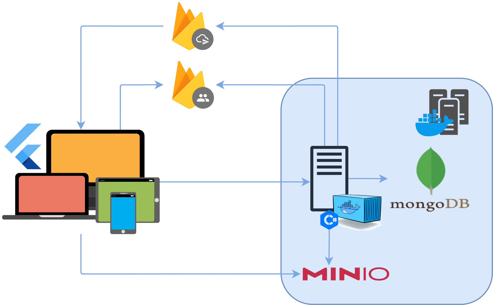

# 🌐 WYD REST API Server

Welcome to the **WYD REST API Server** repository.  
This project powers the backend for WYD, handling all API requests, authentication, database operations, and integrations.  

Given its scalable nature, all business logic code is developed in a sub-module repository called [Core](https://github.com/RedDuality/WYD_Backend_Core), in order to be able to deploy, with minimal changes, over FaaS, if deemed necessary. 

---

## 📖 Documentation

This repository is split into dedicated guides for easier navigation:

- 🛠️ [**WYD Server Guide**](docs/setup.md)  
  Step-by-step instructions for setting up and running the WYD Server locally, including database setup and development workflow.

- ✨ [**Features & Quality of Life**](docs/features.md)  
  Extra tools and workflows that improve your developer experience (e.g., updating the server, database inspection).

- 🚀 [**CI/CD Pipeline with GitHub Actions**](docs/gitCICD.md)  
  Learn how to set up automated deployments.

---
## ⚙️ Tech Stack

- **.NET 9.x** — Core framework powering the REST API  
- **MongoDB** — Main database (local via Docker or in-cluster via Kubernetes)
- **MinIO** - Object storage  (local via Docker or in-cluster via Kubernetes)
- **Docker & Docker Compose** — Local environment and database setup  
- **GitHub Actions** — CI/CD automation   

